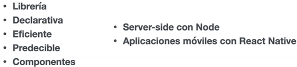

  

# **React de Cero a Experto** #

## **ReactJS** 
ReactJS es una librería usada para frontend y backend (con Next por ejemplo), para crear interfaces de usuario o aplicaciones web, y sigue el concepto de utilizar componentes re-utiliables para lograr un mejor encapsulamiento y mantenimiento.

## **React Native** 
React Native  principalmente es un framwork (tiene muchas cosas al abrirlo de la caja y un patrón de trabajo específico), que usa un motor de JavaScript como host y permite construir aplicaciones móviles (también web y Desktop) utilizando la sintaxis de React pero termina comunicándose con el dispositivo físico en el cual corre.

# **Que es Babel** 
Babel es un "compilador" (o transpilador) para JavaScript. Básicamente permite transformar código escrito con las últimas y novedosas características de JavaScript y transformarlo en un código que sea entendido por navegadores más antiguos.
Usado en React para el Backend